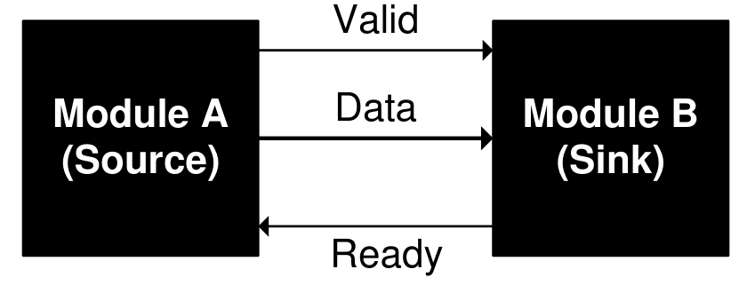
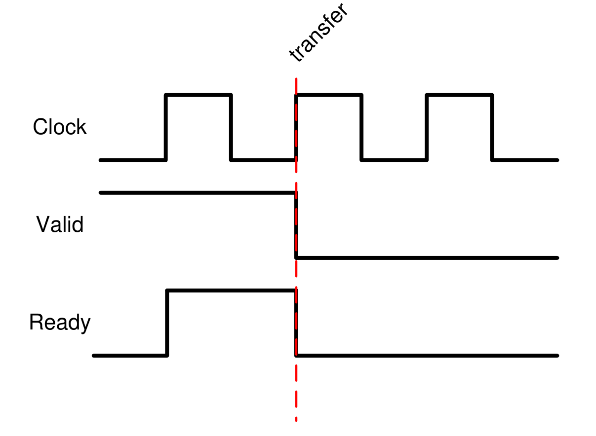
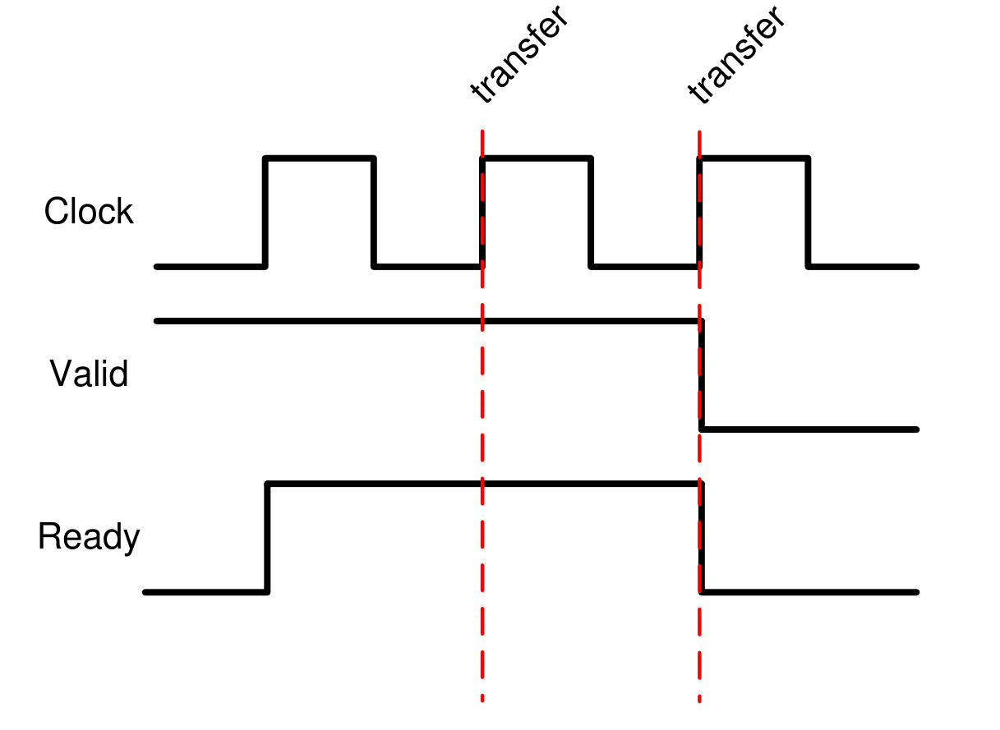
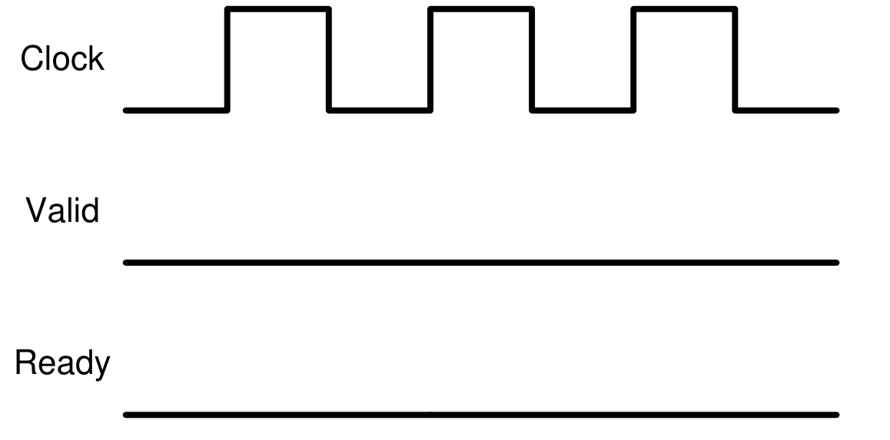
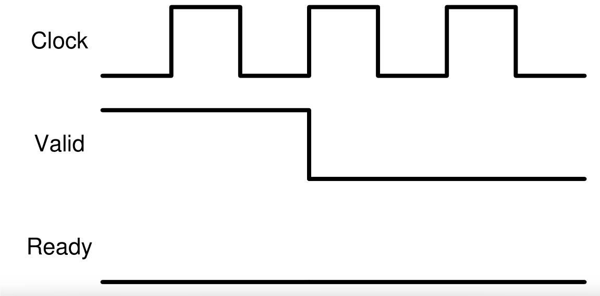
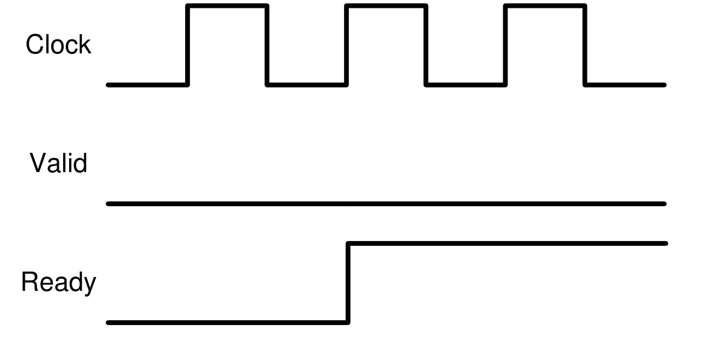
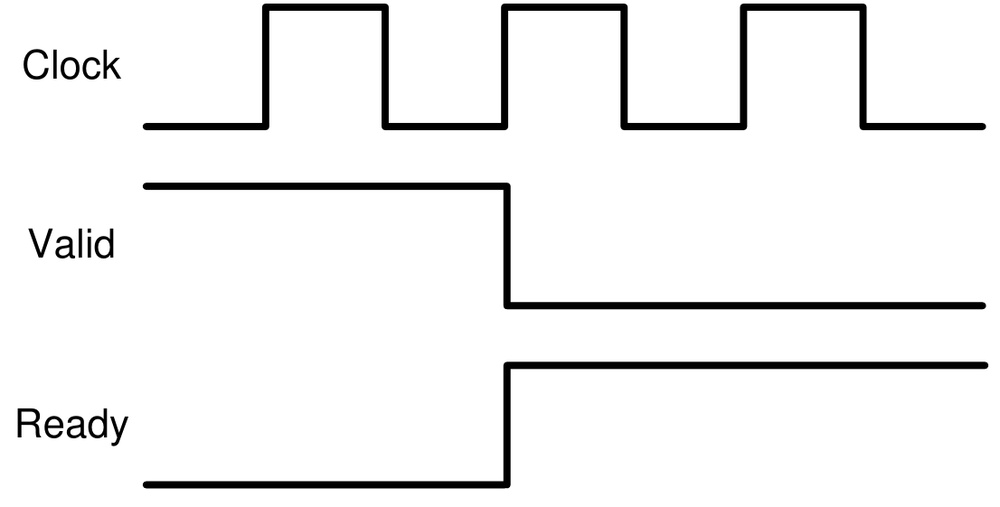
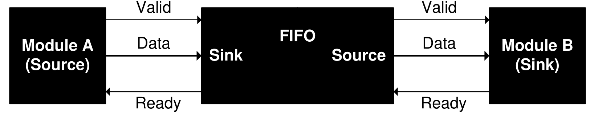
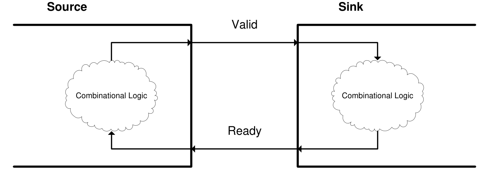

<blockquote class="prompt-warning">
This article is reprinted from <a href="https://inst.eecs.berkeley.edu/~eecs151/sp23/files/docs/fifos.html">UC Berkeley College of Engineering Department of Electrical Engineering and Computer Science</a> by Chris Fletcher.
</blockquote>

## 1 Overview
Perhaps the most important part of creating a large design is how well you connect the different pieces
that comprise the design. Specifically, you are concerned with how the outputs of one component connect
to the inputs of another component.

This document will discuss a general handshake-based interface (input/output port specification)
that modules in your design can conform to. By following this interface specification, you will be able to
connect different modules with no complexity or combinational logic stuck in between them. By following
this interface specification, you will also avoid designing around your own timing assumptions of when
different components need data. As the interface is handshake-based, modules will instead talk to one
another with regards to when they need data.

## 2 The FIFO Interface
This document’s interface specification, which we will the **FIFO Interface** as it works especially well
with units that pass data in a single direction, such as FIFOs, is shown in [Figure 1](#fig-1).
<figure>
    
    <figcaption>Figure 1: The FIFO Interface</figcaption>
</figure>

In [Figure 1](#fig-1), two modules (called the **source** and the **sink**) are connected to one another. When data
is being passed from module to module, the source is the module that is outputting data. The sink is
the module that is receiving that data.

In addition to showing the source and the sink, Figure 1 also shows three signals between the two:
*Data*, *Valid*, and *Ready*. *Data* is the wire that actually passes data from the source to the sink. *Valid* and
*Ready* are known as **handshaking signals** which allow the source and the sink to communicate with
regards to when it is time to pass the data.

The *Valid* signal (output from the source and input to the sink) indicates that the source has put
valid data on the Data line *this* cycle. Valid is what is called a state signal: it is high only when data
is valid. If data is not valid on the *Data* line during a particular cycle, *Valid* should be low during that
cycle.

The *Ready* signal (output from the sink and input to the source) indicates that the sink is ready to
receive new data. *Ready* can be asserted as soon as the sink is ready to receive new data. Whenever the
sink is not ready to receive new data, *Ready* should be low.

## 3 The Handshake and Data Transfer

The FIFO Interface handshake ensures that data passes from the source to the sink only when the source
has valid data to pass and when the sink is ready to receive that data. In other words, when Valid and
Ready are both high, data on Data will be latched into the sink on the next rising edge. This is an
important point: since EECS150 is concerned with synchronous design, data will only be transferred at
the rising edge. This handshake, and when it passes data, is shown in [Figure 2](#fig-2).
<figure>
    
    <figcaption>Figure 2: Data transfer at the rising edge</figcaption>
</figure>

This transfer of data happens on every rising edge where Valid and Ready are both asserted. For each
rising edge, however, only one piece of data is transferred. For example, if Valid and Ready are both high
for two consecutive cycles, we transfer two data words (on consecutive clock cycles; see [Figure 3](#fig-3)).
Note that data transfer only occurs when both Valid and Ready are high. For example, in [Figure 4](#fig-4),
neither Valid nor Ready are high. Thus, no data is transferred. Likewise in [Figure 5](#fig-5) and [Figure 6](#fig-6): if
only one of the two handshaking signals is high, no data is transferred. [Figure 7](#fig-7) shows another example:
if the two handshaking signals are both high at some point, but are out of phase, no data is transferred.
<figure>
    
    <figcaption>Figure 3: Two data transfers at two consecutive rising edges</figcaption>
</figure>
<figure>
    
    <figcaption>Figure 4: Both handshaking signals are low: no data is transferred</figcaption>
</figure>
<figure>
    
    <figcaption>Figure 5: Valid is high and Ready is low: no data is transferred</figcaption>
</figure>
<figure>
    
    <figcaption>Figure 6: Valid is low and Ready is high: no data is transferred</figcaption>
</figure>
<figure>
    
    <figcaption>Figure 7: Both handshaking signals are high at some point, but are out of phase: no data is transferred</figcaption>
</figure>

## 4 Advantages of the FIFO Interface
The FIFO Interface eliminates timing assumptions in your design and removes intermediate combina-
tional logic between modules.

Modules that interface with different pieces of hardware must follow the rules laid out by that hard-
ware *down to the cycle*. To keep track of when every piece of data must be sent / every control signal
must be asserted, students will often construct external counters that count time to determine when
different events should happen. This type of design is crippled by the fact that students are making large
timing assumptions about when each of their modules requires data X or control signal Y. Each module
doesnt give feedback on these counters: they are either right or wrong, but are not based on the actual
state of the module. If a counter gets misaligned, the circuit will fail horribly.

By basing data transfer on handshaking, each module that is handling the data has input as to when
the data should and can be passed along. After designing each module, you as the student can forget
about the timing of that module, and trust that it will keep track of when it is done processing data
and when it is ready to receive more data. The second benefit of the FIFO interface is that it provides
a 2-wire standard for connecting modules. To connect to modules that follow the FIFO interface, all you have to do is connect the Data port from the source to the sink, the Valid port from the source to
the sink, and the Ready port from the sink to the source. When students don’t follow this standard,
they typically substitute in large and complex messes of combinational logic in between each of their
modules to connect them together.**If you design by the FIFO interface, and internalize thelogic that generates** *Valid* and *Ready*, **when it comes time to connect modules, you can do soby just connecting ports together.** Down the road of the project, this will save you **many hours of frustration.**

## 5 When to use the FIFO Interface
The FIFO Interface coordinates data transfer.
Hence, whenever a module you write passes data to
another module, that data should have accompanying Valid and Ready signals. For each Data line that
you write these handshaking signals for, you eliminate your own timing assumptions about when that
data is supposed to be passed from source to sink, and eliminate a potentially nasty bed of combinational
logic between the source and sink.

Some modules will have more than one Data port. Such modules should have more than one pair of
handshaking signals. For example, the standard FIFO, for which this interface is named, takes data in
and passes data out again. A typical FIFO is shown in [Figure 8](#fig-8). Notice that the FIFO serves as both a
source and sink. This is perfectly fine: the FIFO passes and receives data.
<figure>
    
    <figcaption>Figure 8: A FIFO functioning as both a source and sink</figcaption>
</figure>

## 6 A Danger: Combinational Loops
When you design using the FIFO Interface, you must be sure that the Valid and Ready signals are not
combinationally linked at either end. In other words, you should not be able to trace a path from:

1. The output of the Valid signal (in the source)
2. Through the combinational logic that generates the Ready signal (in the sink)
3. Back to the combinational logic that generates the Valid signal (again, in the source)

and visa versa when tracing a path starting at the Ready signal. This path is illustrated in [Figure 9](#fig-9).

<figure>
    
    <figcaption>Figure 9: A combinational loop: avoid this at all costs</figcaption>
</figure>

If you don’t heed this advice, your design will contain a **combinational loop**. Treat combinational
loops as you would latches: if you have one in your design, your circuit will fail miserably.